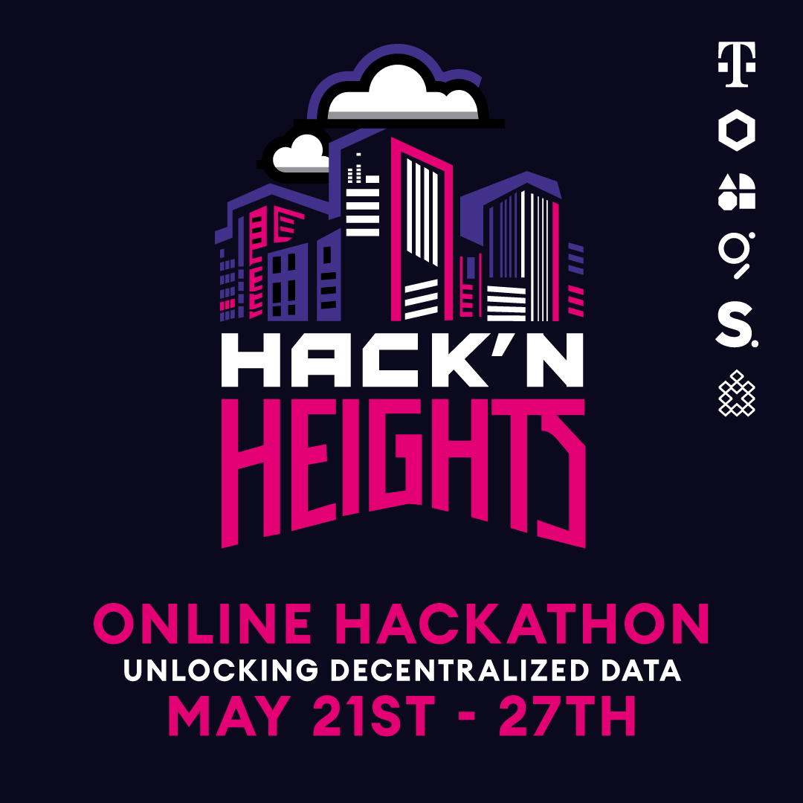

# 💡 App Ideas

<figure><figcaption></figcaption></figure>

## Hack'n Heights Virtual Hackathon (May 21-27)&#x20;

As a participant of this hackathon, you can combine Plurality’s Social Connect widget with other web3 technologies to create interesting applications.

Here are some ideas of what you can do, but don’t get your creativity limited to just these:

**Curate content based on the information you get against the wallet address**

Along with basic bio information, Plurality gives you interests of the user. Use these to show recommendations, reduce noise and improve the overall experience of the user

**Use user’s profile information to gate access to certain actions:**&#x20;

Allow or disallow users to make certain actions on your dApp based on their profile information

**Combine on-chain and off-chain data for smart actions**

You can get user interests from Social connect of a certain wallet address, combine this with subgraphs to get more data points about a wallet address.

**Livepeer integration**&#x20;

Integrate interests with [livepeer ](https://livepeer.org/developers)streams to match the best video streams to recommend to a user. You can use an open source recommendation library like [talisman](https://www.npmjs.com/package/talisman) or some other too.&#x20;

**Gamification through points**

Utilise the user profile information to gamify user experience through giving out points or NFTs&#x20;

**Proof of Social Reputation**

Use the reputation scores in the user profile to distinguish between an active user and an inactive user
