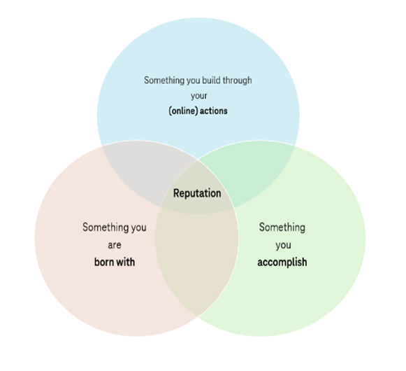

# 🧐 Reputation and Interests

A user's reputation and interests can be extracted from their online activity ([digital footprint](./)).

#### Reputation

The reputation of a person online consists of the data tagged to the person that represents the skillset and capabilities of that person.&#x20;

<figure><figcaption>
How a reputation is derived
</figcaption></figure>

Some examples of reputation are:

1. The information on the LinkedIn profile represents the skill set of the profile owner&#x20;
2. The videos produced on YouTube represent the kind of content the profile owner has mastery over
3. The questions and answers posted on StackOverflow represent the skill level of a developer on a certain technology
4. The code commits on GitHub represent the tech stack expertise of the profile owner
5. The portfolio on Behance shows the design sense of a designer
6. The research papers and H-Index show the quality of research of a researcher
7. &#x20;The amazon seller ratings of a seller show the quality of product and service of a seller

etc.&#x20;

#### Interest

The interests of a person can be extracted from the type of consumed content. Some examples of how interests can be extracted are:

1. Topics of pages liked on Facebook
2. Influencers followed on Instagram
3. Subreddits joined on Reddit
4. Search history on YouTube
5. Created playlists on SoundCloud
6. Pinned images on Pinterest
7. Channels joined on Discord

etc.
