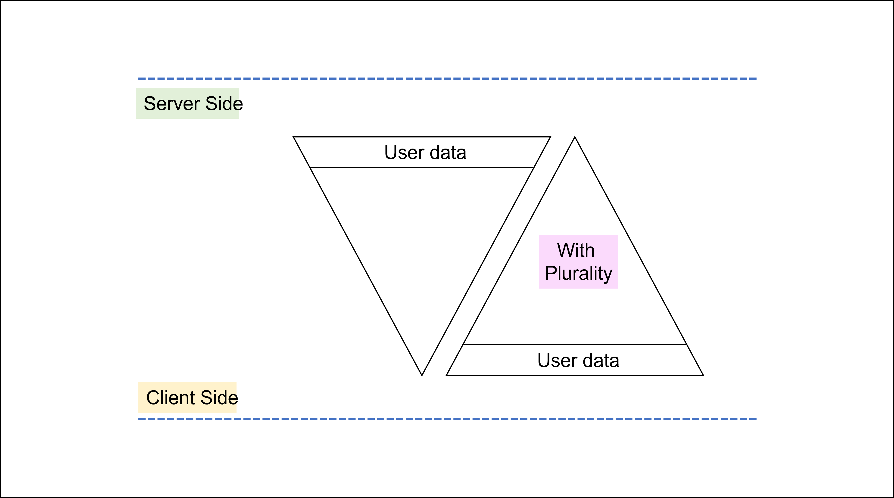

# 🔍 Overview


Pluralism is the existence of different types of people, who have different beliefs and opinions, within the same society.\
[\~ Cambridge Dictionary](https://dictionary.cambridge.org/dictionary/english/pluralism)


## Internet, a global revolution

Internet, now also known as web2, was one of the most revolutionary inventions of mankind, connecting humans in all parts of the world and making them part of a global network.

Today, an average person spends 7 hours online on 7 different platforms daily, and each interaction leaves a small residue of their personality. These residual artifacts constituting your online activity make up your reputation and interests.&#x20;

Your reputation shows who you are and what you can do. Whereas, your interests show what you want to see on the internet.&#x20;

The web platforms use these artifacts to provide an experience catered to your tastes and personality. For example, you see the content you are interested in on social networks. Or you get job offers on LinkedIn relevant to your area of expertise. Overall, web2 platforms have successfully gained and retained users due to the personalized experience they provide.

## The advent of web3

Blockchain networks, also known as web3, were created as a better version of web2. The blockchain technology has been hailed repeatedly as the successor to web2 and has numerous advantages like decentralization, censorship resistance, and most importantly, the focus on user sovereignty.&#x20;

However, despite its notable advantages, web3 platforms have until now largely been unable to retain users and provide them with an experience comparable to web2.

## Web3's weak spot: _User Experience_

Today, when a user lands on a certain dApp, they must first go through complicated wallet creation processes and even after this hassle, the experience they get on the dApp is the same as everyone else. There is no personalization in user experience. This is because each user is a wallet in the blockchain world with no data attached to it other than transactional data.


[Did you know](https://www.ccn.com/news/ethereum-user-retention-dismal-compared-mobile-apps/) that the current user yearly retention rate across web3 dApps is merely 7%?&#x20;


The difficulty in onboarding and lack of personalization leads to a bad user experience, ultimately leading to a high user churn rate and [cold start problem](https://a16z.com/books/the-cold-start-problem/) for dApps.

## Enter a new era of better UX with Plurality

Plurality aims to solve this problem by enabling users to not only easily onboard to web3 platforms, but also link their personality characteristics with their wallet through creation of smart profiles, to be used if, when, and how they want.

<figure><figcaption>
Creating wallet with plurality offers enhanced features
</figcaption></figure>

Such a stack will not only benefit dApps by enabling them to provide a better user experience, but it will also benefit users by giving them easy onboarding, personalized experience, and sovereignty over where their profiles are connected containing which data.

Plurality’s tech stack is the first of its kind, and it inverts the data storage and usage triangle, by moving the state from the server-side to the client-side. This inversion will bring users back in control by letting them control when and how their data is shared.

<figure><figcaption>
Inversion of triangle of user state with plurality
</figcaption></figure>

Plurality inverts the triangle where data is stored and used.

> We need people, not addresses on chain.&#x20;

Once "people" exist on chain rather than just wallets the whole ecosystem will grow leading to a new era of blockchain adoption.

